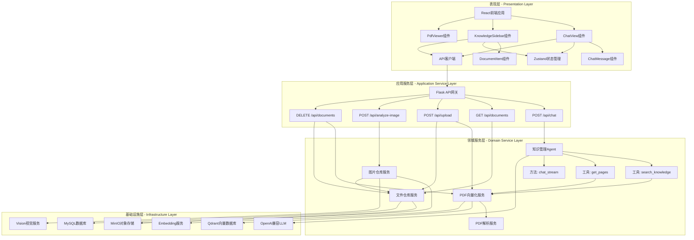
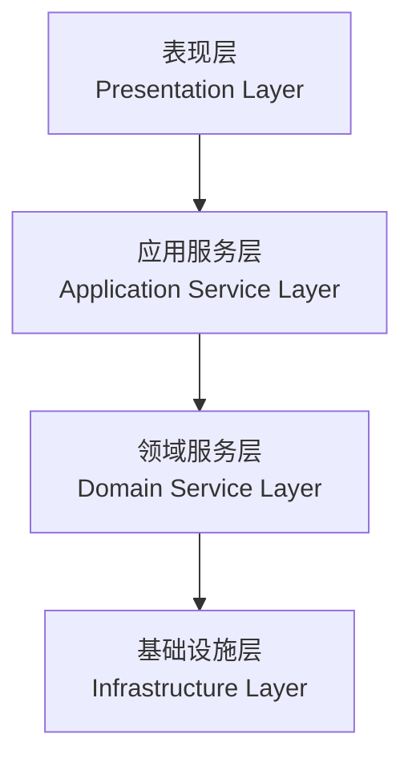
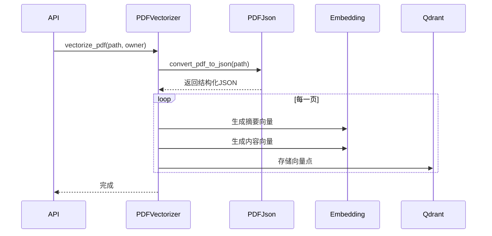
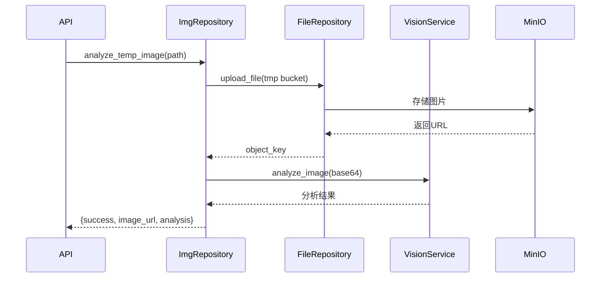
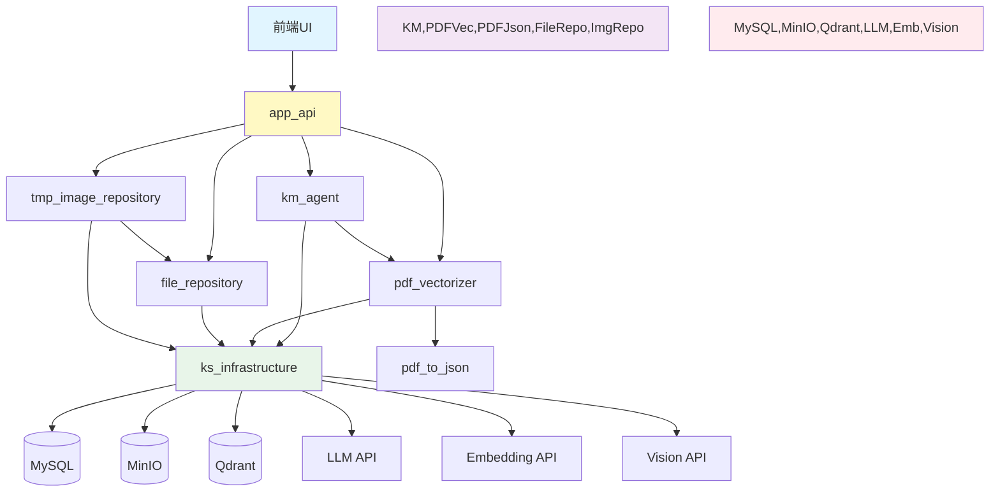
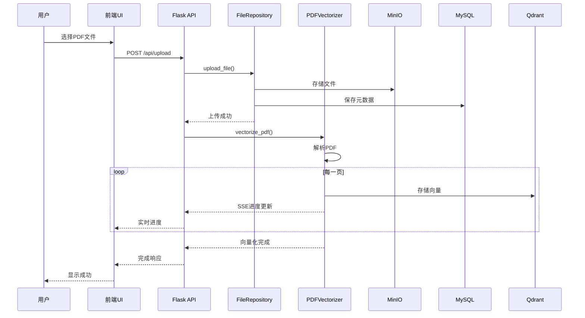
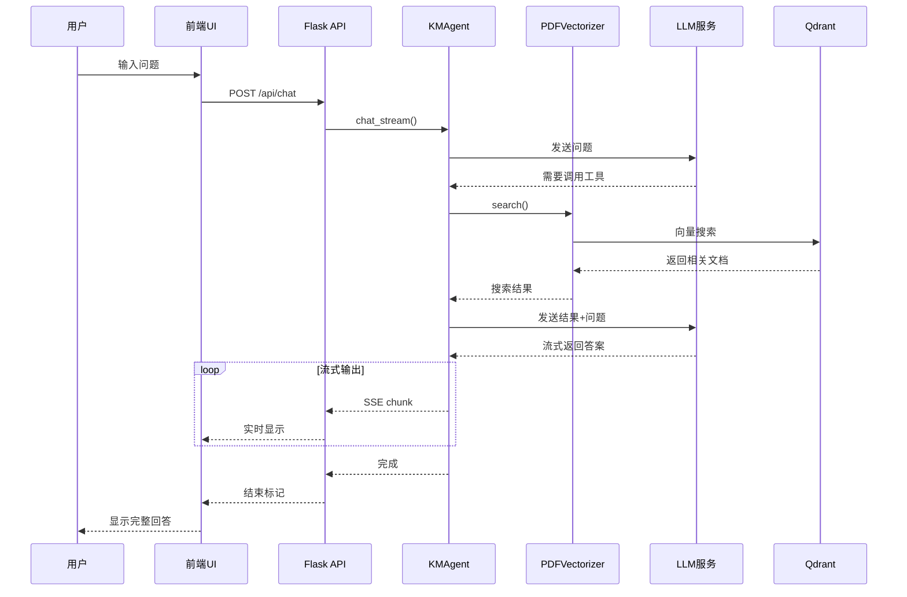
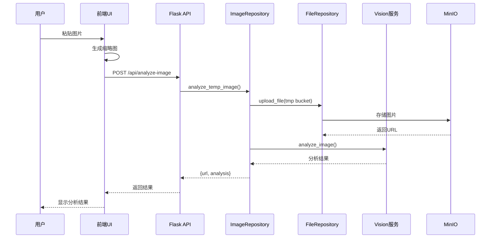

# 知识管理系统 - 系统架构文档

## 目录

- [1. 系统概述](#1-系统概述)
- [2. 架构设计](#2-架构设计)
- [3. 分层架构](#3-分层架构)
- [4. 模块详解](#4-模块详解)
- [5. 服务接口](#5-服务接口)
- [6. 数据流](#6-数据流)
- [7. 技术栈](#7-技术栈)

---

## 1. 系统概述

知识管理系统（KM-Agent）是一个基于大语言模型（LLM）的智能知识管理平台，支持文档上传、向量化存储、语义搜索、智能问答和图片理解等功能。

### 核心能力

- 📄 **文档管理**：PDF文档上传、存储、删除、权限控制
- 🔍 **智能检索**：基于向量数据库的语义搜索
- 💬 **知识问答**：多轮对话、上下文理解、文档引用
- 🖼️ **图片理解**：图片上传、AI视觉分析、结果集成
- 📊 **实时反馈**：SSE流式进度展示、即时响应

---

## 2. 架构设计

### 2.1 整体架构图



### 2.2 分层架构概览



---

## 3. 分层架构

### 3.1 表现层（Presentation Layer）

**职责**：用户交互、数据展示、状态管理

**技术栈**：React 18 + Vite + Zustand + TailwindCSS

**核心组件**：

| 组件名 | 路径 | 职责 |
|--------|------|------|
| `ChatView` | `/ui/src/components/ChatView.jsx` | 聊天界面、消息展示、图片粘贴上传 |
| `ChatMessage` | `/ui/src/components/ChatMessage.jsx` | 消息渲染、Markdown解析、PDF链接处理 |
| `KnowledgeSidebar` | `/ui/src/components/KnowledgeSidebar.jsx` | 文档列表、上传进度、文档操作 |
| `DocumentItem` | `/ui/src/components/DocumentItem.jsx` | 文档项展示、可见性切换、删除操作 |
| `PdfViewer` | `/ui/src/components/PdfViewer.jsx` | PDF预览、页码跳转 |
| `useStore` | `/ui/src/store/useStore.js` | Zustand全局状态管理 |
| `api.js` | `/ui/src/services/api.js` | API客户端封装 |

**对外能力**：
- 🖥️ 提供Web用户界面
- 💬 实时聊天和流式响应展示
- 📄 文档管理操作（上传、删除、查看）
- 🖼️ 图片粘贴和分析集成

---

### 3.2 应用服务层（Application Service Layer）

**职责**：HTTP接口暴露、请求路由、业务编排

**技术栈**：Flask + Server-Sent Events (SSE)

**模块**：`app_api/`

**核心接口**：

| 接口 | 方法 | 路径 | 功能描述 |
|------|------|------|----------|
| 聊天接口 | POST | `/api/chat` | 多轮对话、流式响应 |
| 文档列表 | GET | `/api/documents` | 获取用户可访问的文档 |
| 上传文档 | POST | `/api/upload` | 上传PDF并向量化（SSE进度） |
| 删除文档 | DELETE | `/api/documents/<filename>` | 删除文档和向量数据 |
| 文档可见性 | PUT | `/api/documents/<filename>/visibility` | 设置公开/私有 |
| 文档内容 | GET | `/api/documents/<filename>/content` | 获取PDF文件流 |
| 图片分析 | POST | `/api/analyze-image` | 上传图片并AI分析 |
| 健康检查 | GET | `/api/health` | 服务状态检查 |

**业务编排示例**：

```python
# 文档上传编排
def upload_pdf():
    1. 接收文件上传
    2. 调用 file_repository.upload_file() 存储到MinIO
    3. 调用 PDFVectorizer.vectorize_pdf() 向量化
    4. 通过SSE实时推送进度
    5. 返回完成状态
```

---

### 3.3 领域服务层（Domain Service Layer）

**职责**：业务逻辑实现、领域模型封装

#### 3.3.1 知识管理Agent（km_agent）

**路径**：`/km_agent/`

**对外服务**：

| 类/函数 | 功能 |
|---------|------|
| `KMAgent` | 知识管理智能代理 |
| `KMAgent.chat()` | 同步聊天 |
| `KMAgent.chat_stream()` | 流式聊天（SSE） |
| `KMAgent.search_knowledge()` | 知识库语义搜索 |

**核心能力**：
- 🧠 **智能对话**：基于LLM的多轮对话
- 🔧 **工具调用**：自动调用知识库搜索工具
- 📖 **文档引用**：返回引用来源（文档+页码）
- 🔄 **上下文管理**：维护聊天历史

**依赖**：
- `pdf_vectorizer` - 向量化搜索
- `ks_infrastructure.ks_openai` - LLM服务
- `ks_infrastructure.ks_embedding` - 文本向量化

---

#### 3.3.2 PDF向量化服务（pdf_vectorizer）

**路径**：`/pdf_vectorizer/`

**对外服务**：

| 类/函数 | 功能 |
|---------|------|
| `PDFVectorizer` | PDF向量化管理器 |
| `PDFVectorizer.vectorize_pdf()` | 向量化PDF文档 |
| `PDFVectorizer.search()` | 向量搜索 |
| `PDFVectorizer.delete_document()` | 删除文档向量 |
| `PDFVectorizer.get_pages()` | 获取文档所有分页 |
| `VectorizationProgress` | 向量化进度跟踪 |

**核心能力**：
- 📊 **双路向量化**：摘要向量 + 全文向量
- 🔍 **语义搜索**：基于Qdrant的相似度检索
- 📈 **进度跟踪**：实时反馈向量化进度
- 🗑️ **向量管理**：删除、查询向量数据

**向量化流程**：



**依赖**：
- `pdf_to_json` - PDF解析
- `ks_infrastructure.ks_embedding` - 向量化
- `ks_infrastructure.ks_qdrant` - 向量存储

---

#### 3.3.3 PDF解析服务（pdf_to_json）

**路径**：`/pdf_to_json/`

**对外服务**：

| 类/函数 | 功能 |
|---------|------|
| `PDFToJSONConverter` | PDF转JSON转换器 |  
| `PDFToJSONConverter.convert()` | 将PDF转为结构化JSON |

**核心能力**：
- 📄 **文本提取**：提取PDF文本内容
- 🖼️ **图片识别**：提取图片位置和相对关系
- 📑 **页面分割**：按页组织内容
- 📐 **布局保留**：保留文本和图片的空间位置

**输出格式**：

```json
{
  "pages": [
    {
      "page_number": 1,
      "content": "页面文本内容",
      "summary": "AI生成的摘要"
    }
  ]
}
```

**依赖**：
- 使用 `pdfplumber` 库解析PDF

---

#### 3.3.4 文件仓库服务（file_repository）

**路径**：`/file_repository/`

**对外服务**：

| 函数 | 功能 |
|------|------|
| `upload_file()` | 上传文件到MinIO并记录元数据 |
| `get_file()` | 从MinIO获取文件内容 |
| `list_user_files()` | 列出用户在MinIO中的文件 |
| `get_owner_file_list()` | 从数据库查询文件列表（支持公开文件） |
| `set_file_public()` | 设置文件公开状态 |
| `delete_file()` | 删除文件和元数据 |

**核心能力**：
- ☁️ **对象存储**：MinIO文件存储
- 🗄️ **元数据管理**：MySQL存储文件元信息
- 🔒 **权限控制**：公开/私有文件区分
- 📊 **Bucket隔离**：`kms`（正式文档）、`tmp`（临时图片）

**数据模型**：

```sql
CREATE TABLE file_metadata (
    id INT AUTO_INCREMENT PRIMARY KEY,
    file_path VARCHAR(512) NOT NULL UNIQUE,
    owner VARCHAR(255) NOT NULL,
    filename VARCHAR(255) NOT NULL,
    bucket VARCHAR(255) NOT NULL,
    is_public TINYINT DEFAULT 0,
    content_type VARCHAR(128),
    file_size BIGINT,
    created_at TIMESTAMP DEFAULT CURRENT_TIMESTAMP,
    updated_at TIMESTAMP DEFAULT CURRENT_TIMESTAMP ON UPDATE CURRENT_TIMESTAMP,
    INDEX idx_owner (owner),
    INDEX idx_is_public (is_public),
    INDEX idx_owner_public (owner, is_public)
);
```

**依赖**：
- `ks_infrastructure.ks_minio` - 对象存储
- `ks_infrastructure.ks_mysql` - 元数据存储

---

#### 3.3.5 图片仓库服务（tmp_image_repository）

**路径**：`/tmp_image_repository/`

**对外服务**：

| 函数 | 功能 |
|------|------|
| `analyze_temp_image()` | 上传图片到临时桶并AI分析 |
| `batch_analyze_images()` | 批量分析图片 |
| `DEFAULT_PROMPT` | 默认分析提示词 |

**核心能力**：
- 📤 **临时存储**：图片上传到`tmp` bucket
- 🔍 **视觉分析**：调用Vision API识别图片内容
- 🌐 **公开访问**：自动设置图片公开URL
- ⏱️ **时间戳命名**：避免文件名冲突

**工作流程**：



**依赖**：
- `file_repository` - 文件上传
- `ks_infrastructure.ks_vision` - 视觉识别
- `ks_infrastructure.MINIO_CONFIG` - 配置

---

### 3.4 基础设施层（Infrastructure Layer）

**职责**：底层服务封装、单例管理、配置加载

**模块**：`ks_infrastructure/`

**核心服务**：

| 服务名 | 工厂函数 | 功能 |
|--------|----------|------|
| **MySQL数据库** | `ks_mysql()` | 返回MySQL连接对象 |
| **MinIO对象存储** | `ks_minio()` | 返回boto3 S3客户端 |
| **Qdrant向量数据库** | `ks_qdrant()` | 返回QdrantClient |
| **OpenAI大语言模型** | `ks_openai()` | 返回OpenAI客户端 |
| **Embedding服务** | `ks_embedding()` | 返回EmbeddingService实例 |
| **Vision视觉服务** | `ks_vision()` | 返回VisionService实例 |
| **用户信息服务** | `ks_user_info()` | 返回UserInfoService实例 |

**设计模式**：

- 🏭 **工厂模式**：统一的服务创建接口
- 🔐 **单例模式**：每个服务全局唯一实例
- 📝 **配置中心化**：统一配置管理（`configs/default.py`）

**配置文件结构**：

```python
# ks_infrastructure/configs/default.py
MYSQL_CONFIG = {...}      # MySQL连接配置
MINIO_CONFIG = {...}      # MinIO对象存储配置
QDRANT_CONFIG = {...}     # Qdrant向量数据库配置
OPENAI_CONFIG = {...}     # LLM服务配置
EMBEDDING_CONFIG = {...}  # Embedding服务配置
VISION_CONFIG = {...}     # Vision服务配置
```

**异常体系**：

```python
KsInfrastructureError      # 基础设施异常基类
├── KsConnectionError      # 连接异常
├── KsConfigError          # 配置异常
└── KsServiceError         # 服务异常
```

---

## 4. 模块详解

### 4.1 模块依赖关系



### 4.2 各层职责总结

| 层级 | 职责 | 不允许做的事 |
|------|------|-------------|
| **表现层** | 用户交互、数据展示 | ❌ 不能直接访问数据库<br/>❌ 不能包含业务逻辑 |
| **应用服务层** | 接口暴露、业务编排 | ❌ 不能包含复杂业务逻辑<br/>❌ 不能直接操作基础设施 |
| **领域服务层** | 业务逻辑、领域模型 | ❌ 不能直接使用外部库（通过基础设施层） |
| **基础设施层** | 底层服务封装 | ❌ 不能包含业务逻辑 |

---

## 5. 服务接口

### 5.1 HTTP API接口

#### 5.1.1 聊天接口

```
POST /api/chat
Content-Type: application/json

Request:
{
  "message": "用户问题",
  "history": [...]  // 可选的聊天历史
}

Response: SSE Stream
data: {"type": "content", "data": "响应内容片段"}
data: {"type": "tool_call", "data": {...}}
data: {"type": "done", "data": {"history": [...]}}
```

#### 5.1.2 文档上传接口

```
POST /api/upload
Content-Type: multipart/form-data

Form Data:
- file: PDF文件
- owner: 用户名
- is_public: 0/1

Response: SSE Stream
data: {"stage": "init", "progress_percent": 0}
data: {"stage": "parsing", "progress_percent": 10}
data: {"stage": "completed", "total_pages": 10}
```

#### 5.1.3 图片分析接口

```
POST /api/analyze-image
Content-Type: multipart/form-data

Form Data:
- file: 图片文件
- username: 用户名
- prompt: 分析提示词（可选）

Response:
{
  "success": true,
  "image_url": "http://minio/tmp/user/image.png",
  "analysis": "【以下内容为图片理解结果】\n..."
}
```

### 5.2 领域服务接口

#### 5.2.1 知识管理Agent

```python
from km_agent import KMAgent

agent = KMAgent(verbose=False)

# 同步聊天
response = agent.chat(message="问题", history=[...])

# 流式聊天
for chunk in agent.chat_stream(message="问题", history=[...]):
    if chunk["type"] == "content":
        print(chunk["data"])
```

#### 5.2.2 PDF向量化

```python
from pdf_vectorizer import PDFVectorizer

vectorizer = PDFVectorizer()

# 向量化PDF
vectorizer.vectorize_pdf(
    pdf_path="file.pdf",
    owner="user123",
    display_filename="文档.pdf"
)

# 语义搜索
results = vectorizer.search(
    query="搜索关键词",
    owner="user123",
    limit=5
)
```

#### 5.2.3 文件仓库

```python
from file_repository import upload_file, get_file, get_owner_file_list

# 上传文件
with open("file.pdf", "rb") as f:
    upload_file(
        username="user123",
        filename="doc.pdf",
        file_data=f,
        bucket="kms",
        is_public=0
    )

# 获取文件列表
files = get_owner_file_list(
    owner="user123",
    include_public=True
)
```

---

## 6. 数据流

### 6.1 文档上传流程



### 6.2 智能问答流程



### 6.3 图片分析流程



---

## 7. 技术栈

### 7.1 前端技术栈

| 技术 | 版本 | 用途 |
|------|------|------|
| React | 18.x | UI框架 |
| Vite | 5.x | 构建工具 |
| Zustand | 4.x | 状态管理 |
| TailwindCSS | 3.x | CSS框架 |
| React Markdown | 9.x | Markdown渲染 |
| FontAwesome | 6.x | 图标库 |

### 7.2 后端技术栈

| 技术 | 版本 | 用途 |
|------|------|------|
| Python | 3.9+ | 编程语言 |
| Flask | 3.x | Web框架 |
| OpenAI SDK | 1.x | LLM客户端 |
| Qdrant Client | 1.x | 向量数据库客户端 |
| Boto3 | 1.x | AWS S3（MinIO）客户端 |
| MySQL Connector | 9.x | MySQL驱动 |
| PDFPlumber | 0.11.x | PDF解析 |

### 7.3 基础设施

| 服务 | 用途 |
|------|------|
| **MySQL 8.0+** | 关系型数据库，存储文件元数据 |
| **MinIO** | S3兼容对象存储，存储PDF和图片 |
| **Qdrant** | 向量数据库，存储文档向量 |
| **OpenAI兼容LLM** | 大语言模型服务（如DeepSeek） |
| **Embedding API** | 文本向量化服务 |
| **Vision API** | 图片理解服务（如Qwen-VL） |

---

## 8. 部署架构

### 8.1 单机部署

```
┌─────────────────────────────────────┐
│         Application Server          │
│  ┌──────────┐      ┌──────────┐    │
│  │ Flask    │      │ React    │    │
│  │ :5000    │◄─────┤ :8080    │    │
│  └──────────┘      └──────────┘    │
└─────────────────────────────────────┘
              │
              ▼
┌─────────────────────────────────────┐
│      External Services              │
│  ┌─────────┐  ┌─────────┐          │
│  │ MySQL   │  │ MinIO   │          │
│  │ :3306   │  │ :9000   │          │
│  └─────────┘  └─────────┘          │
│  ┌─────────┐  ┌─────────┐          │
│  │ Qdrant  │  │ LLM API │          │
│  │ :6333   │  │         │          │
│  └─────────┘  └─────────┘          │
└─────────────────────────────────────┘
```

### 8.2 启动命令

```bash
# 一键启动
./start.sh

# 手动启动
python -m app_api.api  # 后端 :5000
cd ui && npm run dev   # 前端 :8080
```

---

## 9. 设计原则

### 9.1 依赖倒置原则

**高层模块不依赖低层模块，都依赖抽象**

- ✅ 应用服务层通过接口调用领域服务
- ✅ 领域服务通过基础设施层的工厂函数获取服务
- ✅ 基础设施层提供统一的抽象接口

### 9.2 单一职责原则

**每个模块只负责一个功能**

- `km_agent` - 只负责智能对话
- `pdf_vectorizer` - 只负责向量化
- `file_repository` - 只负责文件存储

### 9.3 开闭原则

**对扩展开放，对修改关闭**

- ✅ 新增领域服务不影响其他模块
- ✅ 基础设施层可替换实现（如切换数据库）

---

## 10. 扩展性设计

### 10.1 水平扩展

- Flask API可部署多实例（负载均衡）
- 前端静态资源可CDN加速
- Qdrant支持集群部署

### 10.2 功能扩展

**未来可扩展功能**：

1. **多模态支持**：视频、音频文件处理
2. **知识图谱**：实体关系抽取和可视化
3. **协作功能**：多用户共享和权限精细化
4. **自动摘要**：文档自动摘要生成
5. **定时任务**：自动更新向量索引

---

## 附录

### A. 目录结构

```
km-agent/
├── ui/                          # 【表现层】React前端
│   ├── src/
│   │   ├── components/          # UI组件
│   │   ├── services/            # API客户端
│   │   └── store/               # 状态管理
├── app_api/                     # 【应用服务层】Flask API
│   ├── api.py                   # 主应用入口
│   └── config.py                # API配置
├── km_agent/                    # 【领域服务】知识管理Agent
├── pdf_vectorizer/              # 【领域服务】PDF向量化
├── pdf_to_json/                 # 【领域服务】PDF解析
├── file_repository/             # 【领域服务】文件仓库
├── tmp_image_repository/        # 【领域服务】图片仓库
└── ks_infrastructure/           # 【基础设施层】
    ├── services/                # 服务工厂
    └── configs/                 # 配置中心
```

### B. 关键配置

所有配置集中在：`ks_infrastructure/configs/default.py`

### C. 日志规范

- **INFO级别**：正常业务流程
- **WARNING级别**：警告信息
- **ERROR级别**：错误和异常

---

**文档版本**：v1.0  
**最后更新**：2025-11-24  
**维护者**：KM-Agent团队
